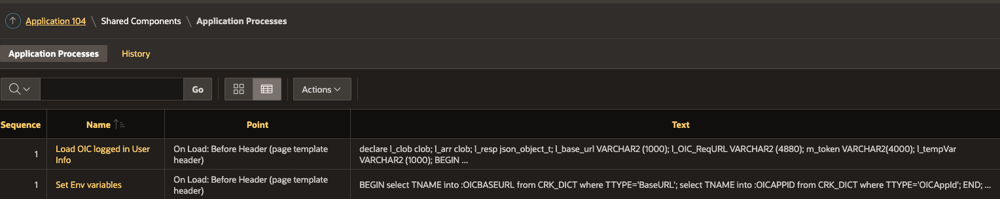
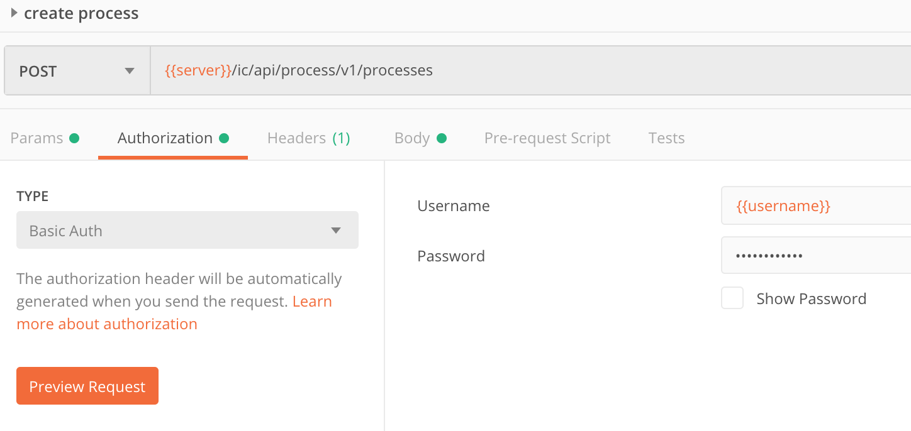
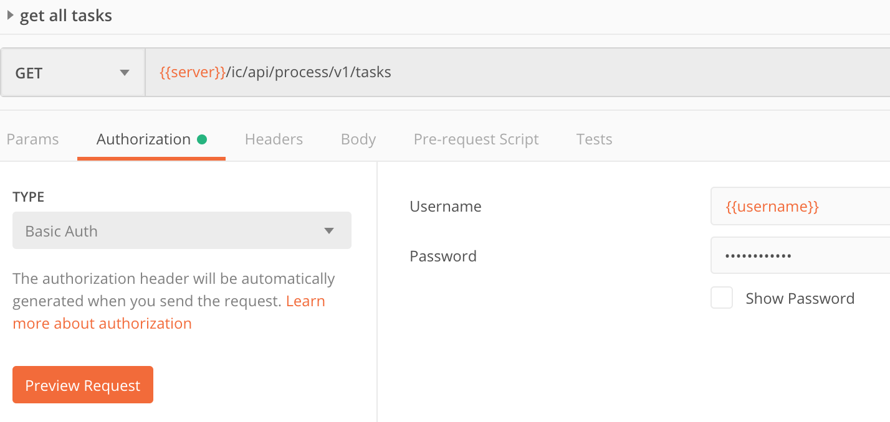
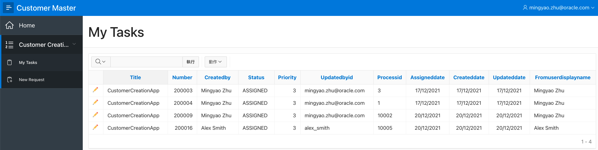
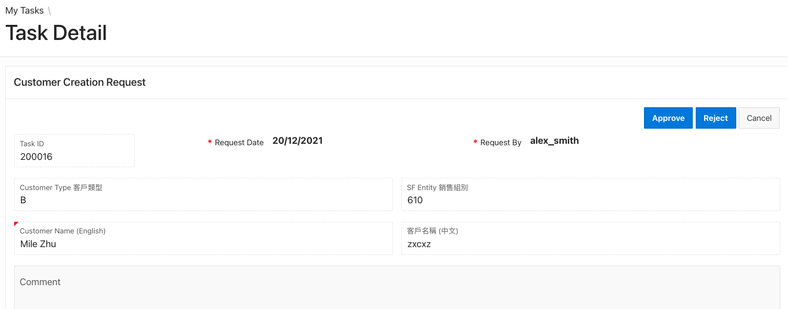
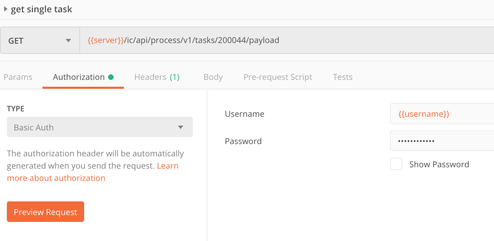
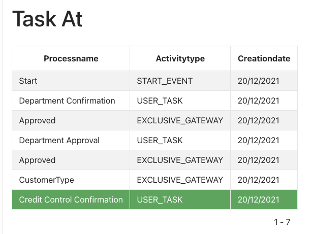

# In this session we will take detail look at APEX app to break it down apart

all integration API are list as below， the main important action are:

- ##### Start Process  - Create a form 

- ##### View Process List - View All Task 

- ##### Action on Process - Approve The Form


Project setting we will be need add application process to get current login user ID and set OIC URL and access token to gobal variable. 



#### 1.Start process  - create a form 



```plsql
declare
	l_clob clob;
	l_base_url VARCHAR2 (4880) := :OICBASEURL || '/ic/api/process/v1/processes';
	PAR varchar2(4000);
	l_opType varchar2(200);
	m_token VARCHAR2(4000);
begin
    SELECT C001 INTO m_token FROM APEX_COLLECTIONS WHERE COLLECTION_NAME='G_CONFIG';
    l_opType := substr(:P3_TYPE,0,1);
    apex_web_service.g_request_headers(1).name := 'Content-Type';
    apex_web_service.g_request_headers(1).value :='application/json';
    apex_web_service.g_request_headers(2).name := 'Authorization';
    apex_web_service.g_request_headers(2).value :='Bearer ' || m_token;    
    PAR := '{
    	"processDefId": "oracleinternalpcs~' || :OICAPPID || '~CustomerCreationProcess",
    	"processName": "CustomerCreationProcess",
    	"serviceName": "CustomerCreationProcess.service",
    	"operation": "start",
    	"action":"Submit",
    	"params":{
        "CustomerName":"' || :P3_CUST_NAME || '",
        "CustomerType":"' || l_opType ||'",
        "CustomerNameChina":"' || :P3_CUST_NAME_CHI || '",
        "CustomerRef":"' || :P3_CUST_REF || '",
        "Email":"' || :APP_USER || '",
        "RequestBy":"' || :P3_REQUEST_BY || '",
        "Date":"' || :P3_REQUEST_DATE || '",
        "Contact":"' || :P3_CONTACT || '",
        "Fax":"' || :P3_FAX || '",
        "AddressLine1":"' || :P3_ADDRESS_LINE1 || '",
        "AddressLine2":"' || :P3_ADDRESS_LINE2 || '",
        "AddressLine3":"' || :P3_ADDRESS_LINE3 || '",
        "AddressRoom":"' || :P3_ADDRESS_ROOM || '",
        "AddressShopNo":"' || :P3_ADDRESS_SHOP_NO || '",
        "AddressFloor":"' || :P3_ADDRESS_FLOOR || '",
        "AddressBlock":"'|| :P3_ADDRESS_BLOCK ||'",
        "AddressBuilding":"' ||:P3_ADDRESS_BUILDING || '",
        "AddressPhase":"' || :P3_ADDRESS_PHASE || '",
        "AddressStreet":"' || :P3_ADDRESS_STREET || '",
        "AddressStreetNo":"' || :P3_ADDRESS_STREET_NO || '",
        "AddressDistrictCode":"' || :P3_ADDRESS_DISTRICT_CODE || '",
        "AddressAreaCode":"'|| :P3_ADDRESS_AREA_CODE || '",
        "AddressOther":"' || :P3_ADDRESS_OTHER || '",
        "PhoneNumber1":"' || :P3_PHONE1 || '",
        "PhoneNumber2":"' || :P3_PHONE2 || '",
        "Remarks":"' || :P3_REMARKS || '",
        "SFentitycodenumber":"' || :P3_SF_ENTITY_CODE || '",
        "BusinessType":"' || :P3_BUSINESS_TYPE || '",
        "SubType":"' || :P3_SUB_TYPE || '",
        "CustGroup":"' || :P3_CUST_GROUP || '",
        "ContactAreaCode":"' || :P3_AREA_CODE || '",
        "RquestID":"' || :P3_FORMID || '"
        }
    }';

    l_clob := apex_web_service.make_rest_request(
        p_url => l_base_url,
        p_http_method => 'POST',
        p_body => PAR);

    if l_clob = 'Unauthorized' THEN
        apex_authentication.logout(:SESSION,:APP_ID);
    END IF;
    htp.p(l_clob);
end;
```


#### 2. View task that assigned to me



this action will call a OIC get task API.  Base on the autherization account, it will return all task for this account.

```plsql
declare
    l_clob clob;
    l_arr   clob;
    l_resp json_object_t;
    l_base_url VARCHAR2 (4880) := :OICBASEURL || '/ic/api/process/v1/tasks';
    m_token VARCHAR2(4000);
    l_error VARCHAR2(1000);
    VAL NUMBER;
begin
    SELECT C001 INTO m_token FROM APEX_COLLECTIONS WHERE COLLECTION_NAME='G_CONFIG';
    
    apex_web_service.g_request_headers(1).name := 'Content-Type';
    apex_web_service.g_request_headers(1).value :='application/json';
    apex_web_service.g_request_headers(2).name := 'Authorization';
    apex_web_service.g_request_headers(2).value :='Bearer ' || m_token;  
    l_clob := apex_web_service.make_rest_request(
        p_url => l_base_url,
        p_http_method => 'GET'
    );

    VAL := APEX_CUSTOM_AUTH.GET_SESSION_ID;
    if l_clob = 'Unauthorized' THEN
        apex_authentication.logout(:SESSION,:APP_ID);
        -- apex_session.delete_session (
        -- p_session_id => VAL 
        -- );
        -- INSERT INTO LOG_INFO (LOGGING) VALUES ('apex_session.delete_session'|| VAL);
    ELSE
        apex_json.parse(
            p_source => l_clob
        );
        APEX_COLLECTION.CREATE_OR_TRUNCATE_COLLECTION(
        p_collection_name => 'TASK_LIST');

        htp.p('l_clob=' || l_clob);
        IF apex_json.get_varchar2('Type') = '503' THEN
            :P2_ERROR := apex_json.get_varchar2('Message');

        INSERT INTO LOG_INFO (LOGGING) VALUES ('Message '|| :P2_ERROR);
        commit;

        ELSE
        :P2_ERROR := null;

        for i in 1..apex_json.get_count('items') LOOP
        APEX_COLLECTION.ADD_MEMBER(
        p_collection_name=>'TASK_LIST',
        p_c001 => apex_json.get_varchar2('items[%d].id', i),
        p_c002 => apex_json.get_varchar2('items[%d].title', i),
        p_n001 => apex_json.get_number('items[%d].number', i),
        p_c004 => apex_json.get_varchar2('items[%d].createdBy', i),
        p_c005 => apex_json.get_varchar2('items[%d].status', i),
        p_c006 => apex_json.get_varchar2('items[%d].state', i),
        p_n002 => apex_json.get_number('items[%d].priority', i),
        p_c011 => apex_json.get_varchar2('items[%d].processDefId', i),
        p_c012 => apex_json.get_varchar2('items[%d].fromUserDisplayName', i),
        p_c013 => apex_json.get_varchar2('items[%d].fromUserName', i),
        p_c014 => apex_json.get_varchar2('items[%d].ownerRole', i),
        p_c015 => apex_json.get_varchar2('items[%d].updatedById', i),
        p_c016 => apex_json.get_varchar2('items[%d].hasSubTasksFlag', i),
        p_c017 => apex_json.get_varchar2('items[%d].processName', i),
        p_c018 => apex_json.get_varchar2('items[%d].processId', i),
        p_d001 => TO_TIMESTAMP(apex_json.get_varchar2('items[%d].assignedDate', i), 'yyyy-mm-dd"T"hh24:mi:ss.ff"Z"'),
        p_d002 => TO_TIMESTAMP(apex_json.get_varchar2('items[%d].createdDate', i), 'yyyy-mm-dd"T"hh24:mi:ss.ff"Z"'),
        p_d003 => TO_TIMESTAMP(apex_json.get_varchar2('items[%d].updatedDate', i), 'yyyy-mm-dd"T"hh24:mi:ss.ff"Z"')
        );
        end loop;  
        END IF;
    END IF; 
    
    EXCEPTION 
        WHEN OTHERS THEN
        apex_json.parse(
            p_source => l_clob
        );
        :P2_ERROR := apex_json.get_varchar2('Message');
        delete from LOG_INFO;
        INSERT INTO LOG_INFO (LOGGING) VALUES('error in rest call' || apex_json.get_varchar2('Message'));
        commit;
END;
```


#### 3. View a single task

 With Interactive report functionality. we can directly click the pencil icon in the report to view task details.



Get into Task Detail page:




#### 4.Get task payload(form data)



```plsql
declare
    l_clob clob;
    l_resp  json_object_t;
    l_acctoken  VARCHAR2(512);
    l_base_url VARCHAR2 (4880) :=  :OICBASEURL || '/ic/api/process/v1/tasks/';
     m_token VARCHAR2(4000);
begin
    SELECT C001 INTO m_token FROM APEX_COLLECTIONS WHERE COLLECTION_NAME='G_CONFIG';
    apex_web_service.g_request_headers(1).name := 'Content-Type';
    apex_web_service.g_request_headers(1).value :='application/json';
    apex_web_service.g_request_headers(2).name := 'Accept';
    apex_web_service.g_request_headers(2).value :='application/json';
    apex_web_service.g_request_headers(3).name := 'Authorization';
    apex_web_service.g_request_headers(3).value :='Bearer ' || m_token;  
    l_clob := apex_web_service.make_rest_request(
        p_url => l_base_url || to_char(:P4_NUMBER_) || '/payload',
        p_http_method => 'GET'
    );

    IF substr(l_clob,0,1) = '{' THEN 
        INSERT INTO LOG_INFO (LOGGING) VALUES ('CODE loading Audit page:'|| l_clob );
        commit;
        apex_json.parse(
            p_source => l_clob
        );
        :P4_FORMID := to_char(:P4_NUMBER_);
        :P4_CUST_NAME := apex_json.get_varchar2('customerName');
        :P4_REQUEST_DATE := :P4_UPDATEDDATE;
        :P4_REQUEST_BY := apex_json.get_varchar2('requestBy');
        :P4_TYPE := apex_json.get_varchar2('customerType');
        :P4_SF_ENTITY_CODE := apex_json.get_varchar2('sFentitycodenumber');
        :P4_CUST_NAME_CHI := apex_json.get_varchar2('customerNameChina');
        :P4_CONTACT := apex_json.get_varchar2('contact');
        :P4_PHONE1 := apex_json.get_varchar2('phoneNumber1');
        :P4_PHONE2 := apex_json.get_varchar2('phoneNumber2');
        :P4_FAX := apex_json.get_varchar2('fax');
        :P4_BUSINESS_TYPE := apex_json.get_varchar2('businessType');
        :P4_SUB_TYPE := apex_json.get_varchar2('subType');
        :P4_CUST_GROUP := apex_json.get_varchar2('custGroup');
        :P4_AREA_CODE := apex_json.get_varchar2('contactAreaCode');
        :P4_CUST_REF := apex_json.get_varchar2('customerRef');
        :P4_REMARKS := apex_json.get_varchar2('remarks');
    ELSIF l_clob = 'Unauthorized' THEN
        -- :P4_FORMID := 'test';
        apex_authentication.logout(:SESSION);
    ELSE
        INSERT INTO LOG_INFO (LOGGING) VALUES ('CODE ERROR '|| l_clob );
        commit;
    END IF;
end;
```


#### 5.Get history actions 



```plsql
declare
    l_clob CLOB;
    l_blob BLOB;
    l_resp  json_object_t;
    l_acctoken  VARCHAR2(512);
    l_base_url VARCHAR2 (4880) :=  :OICBASEURL || '/ic/api/process/v1/processes/';
     m_token VARCHAR2(4000);
begin
   SELECT C001 INTO m_token FROM APEX_COLLECTIONS WHERE COLLECTION_NAME='G_CONFIG';
   apex_web_service.g_request_headers.delete();
   apex_web_service.g_request_headers(1).name := 'Content-Type';
   apex_web_service.g_request_headers(1).value :='image/png';
   apex_web_service.g_request_headers(2).name := 'Authorization';
   apex_web_service.g_request_headers(2).value :='Bearer ' || m_token;  
   l_clob := apex_web_service.make_rest_request(
       p_url => l_base_url || :P4_PROCESSID || '/audit?graphicFlag=false',
       p_http_method => 'GET'
   );
   if apex_web_service.g_status_code = 200 then
       apex_json.parse(
           p_source => l_clob
       );

       apex_collection.create_or_truncate_collection( 'TASK_GRAPH' );
       for i in 1..apex_json.get_count('processHistory') LOOP
           apex_collection.add_member(
               p_collection_name => 'TASK_GRAPH',
               p_c001 =>  apex_json.get_varchar2('processHistory[%d].activityName',i),
               p_c002 =>  apex_json.get_varchar2('processHistory[%d].activityType',i),
               p_d001 => TO_TIMESTAMP(apex_json.get_varchar2('processHistory[%d].creationDate', i), 'yyyy-mm-dd"T"hh24:mi:ss.ff"Z"')
           );
       END LOOP;
   ELSE 
       INSERT INTO LOG_INFO (LOGGING) VALUES ('graph: '|| substr(l_clob,0,30) );
       commit;
   END IF;

end;
```


#### 6. Approval or reject a task item

here we will assign P4_OPT with value that you want to use (you named in OIC gateway) along with  P4_COMMENT and pass the value to the API:

```plsql
declare
 l_clob clob;
 l_base_url VARCHAR2 (4880) := :OICBASEURL || '/ic/api/process/v1/tasks/';
 PAR VARCHAR2(4000);
 l_session BOOLEAN;
 m_token VARCHAR2(4000);
begin
        SELECT C001 INTO m_token FROM APEX_COLLECTIONS WHERE COLLECTION_NAME='G_CONFIG';
        apex_web_service.g_request_headers(1).name := 'Content-Type';
        apex_web_service.g_request_headers(1).value :='application/json';
        apex_web_service.g_request_headers(2).name := 'Authorization';
        apex_web_service.g_request_headers(2).value :='Bearer ' || m_token;  
        PAR := '{ 
            "identities":[{"id":"'|| V('APP_USER') ||'","type":"user" }],
            "action":{"id":"' || :P4_OPT || '","type":"Custom"}, 
            "comment":{"commentStr":"'|| :P4_COMMENT ||'","commentScope":"BPM"}
            }';
        l_clob := apex_web_service.make_rest_request(
        p_url => l_base_url || to_char(:P4_NUMBER_),
        p_http_method => 'PUT',
        p_body => PAR);
        INSERT INTO LOG_INFO (LOGGING) VALUES (:P4_OPT || l_clob );
        commit;
        htp.p(l_clob);

end;
```

