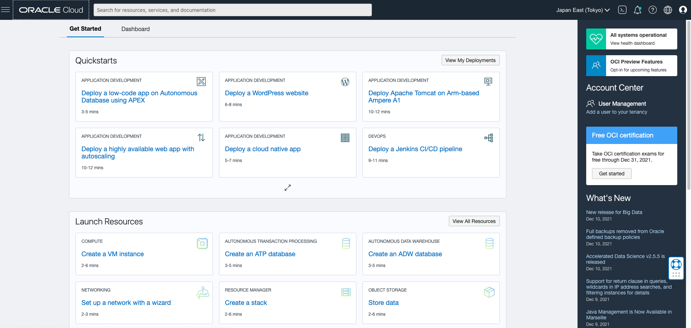
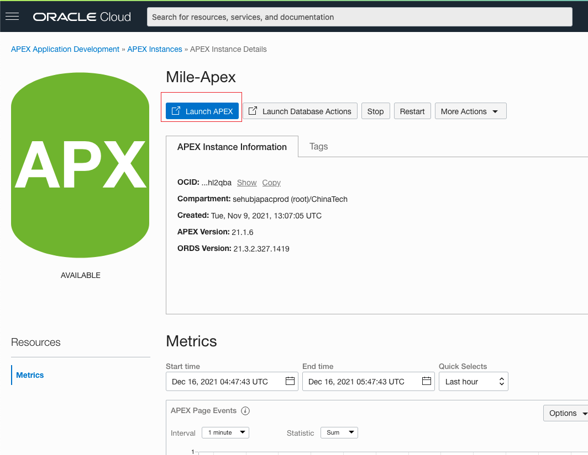
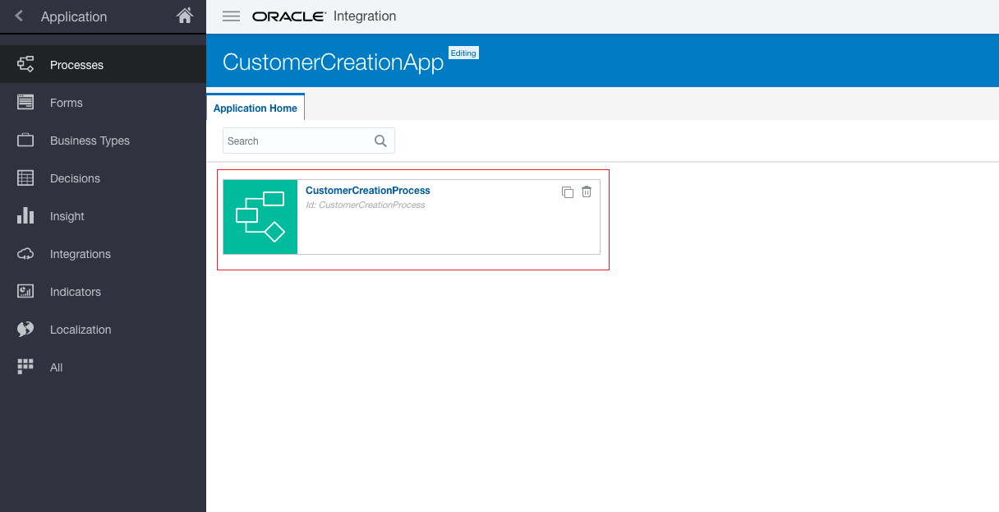
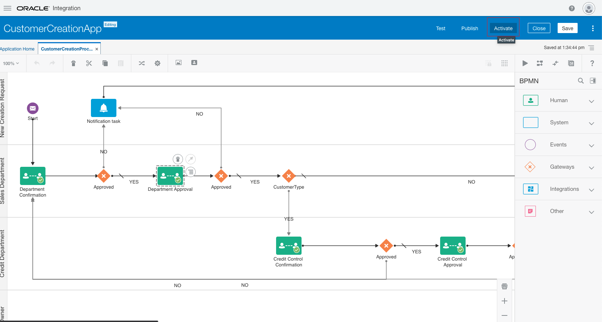
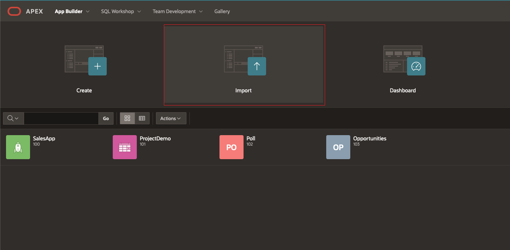
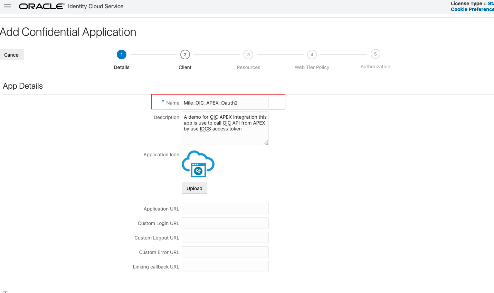
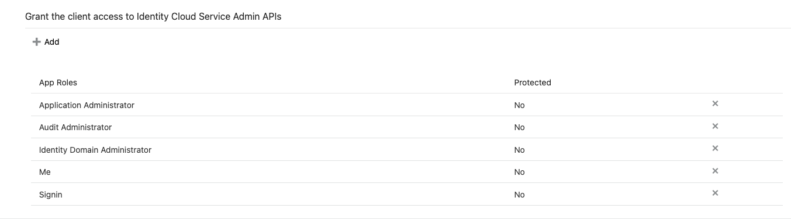
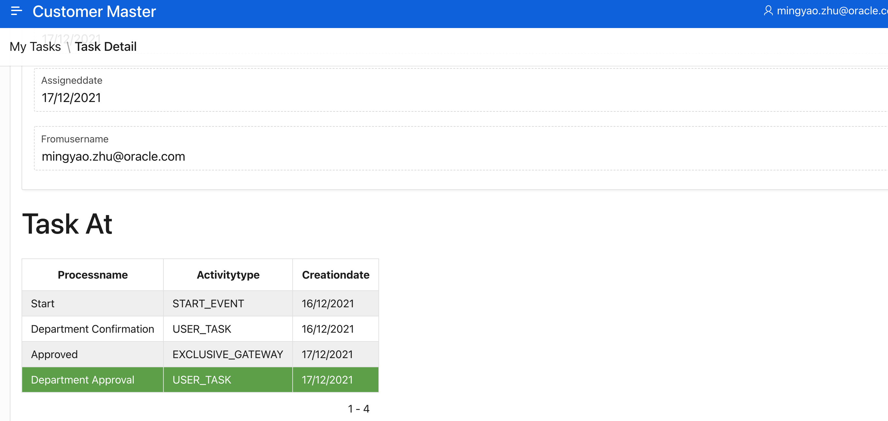

# Business Scenario

With the power of Oracle Integration Cloud process and workflow, we create Oracle Integration Cloud proccess application as backend engine. And for people already take adventages in Oracle APEX User Interface and oracle Database, you can easily build integrations with OIC and still use SSO as authorization scheme.

Here is a example of how to take advantage of this solution:


busniess workflow : 

APEX user submit form to active the proccess from APEX -> Sales Department first Comfirmation ->  Sales Department Second Approval  -> check for customer type if it is VIP customer -> Credit Department Third Comfirmation -> Credit Department Fourth Approval -> (Do anything you want) - > END proccess

Workflow is not fixed, your busniess changes and upgrade everyday. The old way people need change their program, doing development to fulfill the busniess need. Which will take days/months and the test and debug is nightmare. This solution avoid all of it. People can change existing workflow or link to new workflow as you need.  we can edit and manage workflow direcly in OIC application without change anything in APEX side.

And with this IDCS integration, inovate more. since OIC is integration cloud, your APEX now can easily connect to Saas applications,third-party SaaS and on-premises apps.

# Tutoiral Steps

1. [Create OIC instance](#memu_step1)

2. [Create APEX instance](#memu_step2)

3. [Add group and user](#memu_step3)

4. [Assign OIC Role](#memu_step4)

5. [OIC import workshop project](#memu_step5)

6. [APEX import workshop Project](#memu_step6)

7. [Config IDCS application](#memu_step7)

8. [Config APEX application](#memu_step8)

9. [Test and Run Application](#memu_step9)

10. [End User experience](#memu_step10)

    


<a name="memu_step1"></a>

# Create OIC instance

##### Step 1: Login to OCI console with your username / password and the homepage looks as below: 

[cloud.oracle.com](cloud.oracle.com) 



##### Step 2: Click on the Hamburger icon on top left, navigate to developer services and then select integration as shown in the below  


##### Step 3: Select the respective compartment and click on create button to create Integration instance as shown below.  

 

##### Step 4: Provide the respective details and click on create button to create the integration as shown below.  


##### Step 5:  click on "Service Console" to save your **OIC instance URL**

  


<a name="memu_step2"></a>

# Create APEX instance

##### Step 1: Click on the Hamburger icon on top left, navigate to Oracle Database and then select Autonomous Database as shown in the below   


##### Step 2: Select the respective compartment and click on create button to create autonomous database as shown below.  


##### Step 3: Enter encessary information enter admin passoword then select “Create Autonomous Database” button.


##### Step 4: Once its built, click on Launch APEX button




##### Step 5: Enter user name password for admin login page to enter admin workspace console. Create a workspace to build application in workspace.


##### Step 6: Create workspace


##### Step 7: Login to this workspace (use the switch button below the Sign in button to swith between admin services and workspace login.)


<a name="memu_step3"></a>

# Add group and user

Since APEX integration application as UI, people need login as IDCS user. And user need some role settings in OIC as well.

##### Step 1:  in Cloud console click on Identity & Security and delete Federation.


<a name="IDCS_CONSOLE"></a>

##### Step 2:  click on the link in the middle to enter IDCS page 


##### Step 3:  navigate to Users 


##### Step 4:  input First Name Last Name and Email - click finish button (An active email will be send to this user)


##### Step 5:  navigate to Group add a group like below


##### Step 6:  inside this Group click on Assign button to add user in this group


<a name="memu_step4"></a>

# Assign OIC role 

##### Step 1:  Still in IDCS console click left top menu select Oracle Cloud Services


##### Step 2:  search for the OIC name your just create in this case I searched "oic" , navigate to Application role in the top tab button area, In "serviceAdministrator" at the very end click that menu button. 


##### Step 3:  select Assign Group search for the Group name you just created. and select it. hit "OK"


Therefor we have bind this group to have OIC service admin role for my OIC instance. Every user in this group will have the access. you can assign different role like "Service Developer" to different group as well.


<a name="memu_step5"></a>

# OIC import workshop project

For this workshop we will be use a demo project for importing and we can use it straight ahead. For detail how to create the OIC process application please navigate to [OIC part](https://github.com/MileSone/APEX_OIC_WORKSHOP/tree/main/OIC)

##### Step 1: in the projects folder, download two projects


##### Step 2:  open OIC instance URL , in console click processes in the left top menu


##### Step 3:  on the top right click “Create” button


##### Step 4: select import project  


##### Step 5:  choose the file "OIC_project.exp" enter a name for it and click import button.


##### Step 6:  then the Application is created, now we publish and start using it.



##### Step 7:  click into it. on the top right click" Publish" button 

				

##### Step 8:  on the pop up window enter some comments then hit publish


##### Step 9:  on the top right click "Activate" button.



##### Step 10:  click "Activate new version"


##### Step 11: follew the steps click on >validate


##### Step 12: enter a version "1.0" click on >validate


##### Step 13: click finish


##### Step 14: on the top left navigate back to home


##### Step 15:  click on "Process" - "Process Application" in the menu, click "Activate" button on the top right (this is where all activate application is listed)


##### Step 16: select the right menu icon for the app you activated.


##### Step 17: click on web services


##### Step 18: open this URL


##### Step 19: sreach for the "1.0" and you will find a OICAPPID!VERSION*soaXXXXXXXXXX string save it:

OIC application Define ID:`CustomerCreationApp!1.0*soa_2a2f1c2d-7186-4733-91ed-91c76868112c`


###### now the OIC application has successfully deployed and activated , now we will need add some user to application roles, inorder to let them do approval/ reject action, create request or review the process.

##### Step 20:  In the OIC select "My Tasks"


##### Step 21:  select Administration


##### Step 22:  In the process Roles, select the role name that you want to add people with. at right hand click on "Add member" and search by email name to add member. In this case you can add your email to "New Creation Request"  "Credit Department" "Sales Department".


<a name="memu_step6"></a>

# APEX import Project

In this workshop we will import a demo APEX project. In APEX we will import application and database tables.

##### Step 1:  Login APEX click on App Builder


##### Step 2:  Click on Import button



##### Step 3:  drag the apex_project.sql into it. click Next


##### Step 4:  click next


##### Step 5:  click Next


##### Step 6:  Click on Edit Application


##### Step 7:  Save your URL and App ID

APEX baseURL:https://g30345bc1601f57-XXXX.adb.ap-tokyo-1.oraclecloudapps.com

APEX Application ID on top left: 104

##### then Click on SQL workshop, choose  SQL commands


##### Step 8:  Create Datatables for this project:

###### run each row to create table first

```
CREATE TABLE  "CRK_DICT" 
   (    "ID" NUMBER GENERATED BY DEFAULT AS IDENTITY MINVALUE 1 MAXVALUE 9999999999999999999999999999 INCREMENT BY 1 START WITH 1 CACHE 20 NOORDER  NOCYCLE  NOKEEP  NOSCALE  NOT NULL ENABLE, 
    "TNAME" VARCHAR2(4000) COLLATE "USING_NLS_COMP", 
    "TTYPE" VARCHAR2(200) COLLATE "USING_NLS_COMP"
   )  DEFAULT COLLATION "USING_NLS_COMP"
/
CREATE TABLE  "LOG_INFO" 
   (    "LOGGING" VARCHAR2(4000) COLLATE "USING_NLS_COMP", 
    "UPDATEDAT" TIMESTAMP (6) DEFAULT CURRENT_TIMESTAMP, 
    "ID" NUMBER GENERATED BY DEFAULT AS IDENTITY MINVALUE 1 MAXVALUE 9999999999999999999999999999 INCREMENT BY 1 START WITH 1 CACHE 20 NOORDER  NOCYCLE  NOKEEP  NOSCALE  NOT NULL ENABLE
   )  DEFAULT COLLATION "USING_NLS_COMP"
/
```

###### replace the value of OIC define ID and BaseURL for OIC instance URL

```
INSERT INTO CRK_DICT(TTYPE ,TNAME) VALUES('OICAppId','CustomerCreationApp!1.0*soa_2a2f1c2d-7186-4733-91ed-91c768681XXX')
INSERT INTO CRK_DICT(TTYPE ,TNAME) VALUES('BaseURL','https://oic-mile-workshop-XXXXXX-nt.integration.ocp.oraclecloud.com')
```

###### Select the SQL then hit run 


Note: With these set up, we have added the application and database tables, however this application is using SSO, unless we change it to others or create IDCS application for this APEX app we won't able to run the app.

save your APEX base URL for example: 


<a name="memu_step7"></a>

# Config IDCS application

Lets now create IDCS application, this IDCS is controlling the users who can login and logout from APEX UI. And this application is conrolling who can invoke OIC API in the scope.

##### Step 1:  Create IDCS app

navigate to [IDCS Console](#IDCS_CONSOLE)

Select Application on the menu

Click on Add button to add a application 


##### Step 2:  Create IDCS app details

choose Confidential Application


Enter a name;



For Configuration tab enter same value as below image

save your current Page Base URL (**IDCS URL**) like:  https://g30345bc1601f57-db202106151059.adb.ap-tokyo-1.oraclecloudapps.com

Redirect URL : <APEXURL>/ords/apex_authentication.callback

POST logout Redirect URL : <APEXURL>/ords/f?p=<your APEX App ID>


click Add scope search for the OIC name your created, and system will give you a scope like:


add some Roles select them as below.




Edit resources like below put Primary Audience as OIC Base URL like:

https://oic-mile-workshop-sehubjapacprod-nt.integration.ocp.oraclecloud.com


##### Step 3:  Activate the IDCS App


make sure save Client ID and Secret for later use


<a name="memu_step8"></a>

# Config APEX application

We have successful activate our IDCS application. Now we will link APEX application to this IDCS app.

##### Step 1:  Configure Web credentials

- In APEX application 104 -> share components -> Web Credentials 
- Edit a web credential called "IDCS_Application_Credentials"
- Put OAuth2 as Authentication Type
- OAuth Scope we put IDCS app scope system generated like https://BF1CB539D29C437F8B4F9EE42398255F.integration.ocp.oraclecloud.com:443urn:opc:resource:consumer::all
- put Client ID
- put Client Secret
- Apply Changes


##### Step 2:  Configure Authentication Schemes

- Choose OIC_IDCS_AUTH
- Scheme Type : Social Sign-In
- Discovery URL: <IDCS BASE URL>/.well-known/openid-configuration
- Scope: we put IDCS app scope system generated
- Change Post-Logout URL: <APEX BASEURL>/ords/f?p=<ApplicationID>
- Then hit Apply changes


and now we can run this application with IDCS username password, and you will see the Application


<a name="memu_step9"></a>

# Test Application

now lets login and test


Now you can create a customer creation request. (with OIC "New Creation Request"  role)


And logged in user can see their tasks.


Click into a single one user can enter commands, see where the task at, and approve or reject the task.




With OIC Email notification enable user will receive email notifications as well


In OIC Console click My Tasks in the menu - select Processes.


***You can see in graphical view to check where the task at.  Which department is blocking the workflow !***


<a name="memu_step10"></a>

# End User experience

In the video we will show how to use this OIC+APEX demo.

*Alex acts as request creator.*

*Oscar is an approver in the Sales Department.*

**People have different roles assigned in OIC, they will have different access in this APEX application!**

https://user-images.githubusercontent.com/6970416/146891233-17615c1e-5394-485d-be76-43539e8b9bd3.mp4

https://user-images.githubusercontent.com/6970416/146891271-b714fcad-ea47-4705-81ba-5cda372a2c62.mp4

https://user-images.githubusercontent.com/6970416/146891443-7698adb0-8d1e-497b-9a8c-fd1f80e7b301.mp4
